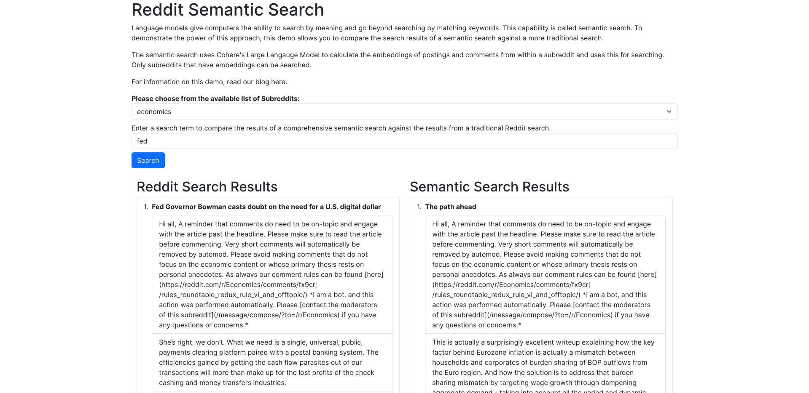

# Reddit/Semantic Search Forum

This is the code for the demo for a technical article showing off the use of Cohere's semantic search API. The app is written in [Flask](https://flask.palletsprojects.com/en/2.2.x/) and styled with [Boostrap](https://getbootstrap.com/). Here's a screenshot of what it looks like:



## Credentials

To run the app, credentials are needed to access the Reddit and Cohere APIs. Create a `credentials.json` file at the root level of this repository with the following structure:

```json
{
    "client_id": "REDDIT_CLIENT_ID",
    "client_secret": "REDDIT_CLIENT_SECRET",
    "username": "REDDIT_USERNAME",
    "password": "REDDIT_PASSWORD",
    "cohere_api_key": "COHERE_API_KEY"
}
```

## Development

First, create a new Python virtual environment, activate it, and install the dependencies:

```
python -m venv venv
. venv/bin/activate
python -m pip install -r requirements.txt
```

Then, to run a development server for the app, simply execute `flask run` at the top level of this repository.

## Deployment

To deploy the app, refer to Flask documentation on [deploying to production](https://flask.palletsprojects.com/en/2.2.x/deploying/)